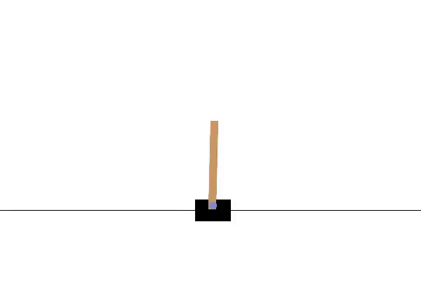

# DA6400_RL_PA1

## Submitted by
Jayagowtham J ME21B078

Lalit Jayanti ME21B096

## File Structure 

```python
.
├── acrobot_ddqn_t1_tune.py         # Acrobot-v1 Training / Tuning
├── acrobot_ddqn_t2_tune.py
├── acrobot_ddqn_train.ipynb
├── acrobot_reinforce_t1_tune.py
├── acrobot_reinforce_t2_tune.py
├── acrobot_reinforce_train.ipynb
├── cartpole_ddqn_t1_tune.py        # CartPole-v1 Training / Tuning
├── cartpole_ddqn_t2_tune.py
├── cartpole_ddqn_train.ipynb
├── cartpole_reinforce_t1_tune.py
├── cartpole_reinforce_t2_tune.py
├── cartpole_reinforce_train.ipynb
├── configs
│   ├── acrobot_ddqn_t1.yaml        # Acrobot-v1 Tuning configurations
│   ├── acrobot_ddqn_t2.yaml
│   ├── acrobot_reinforce_t1.yaml
│   ├── acrobot_reinforce_t2.yaml
│   ├── cartpole_ddqn_t1.yaml       # CartPole-v1 Tuning configurations
│   ├── cartpole_ddqn_t2.yaml
│   ├── cartpole_reinforce_t1.yaml
│   └── cartpole_reinforce_t2.yaml
├── scripts
│   ├── ddqn_agent.py               # Dueling Deep Q-Network Agent (Type 1/2)
│   ├── helpers.py
│   ├── reinforce_agent.py          # Monte-Carlo REINFORCE Agent (Type 1/2)
│   └── training.py
├── requirements.txt
├── README.md
```
## Basic usage
- ```pip install -r requirements.txt```
- To run experiments with different hyper-parameters
    - ```wandb login```
    - Choose a configuration file from <i>/configs</i>
    - Change <i>project</i> and <i>entity</i> to your requirements
    - Change interpreter path to match your python path
    ```ruby
    python3 {env}_{algorithm}_t{type}_tune.py
    # env       {cartpole, acrobot}
    # algorithm {ddqn, reinforce}
    # type      {1, 2}
    ```
- To analyze results, fill the hyperparameters in the second cell and run
  - Cartpole DDQN  : [cartpole_ddqn_training.ipynb](cartpole_ddqn_train.ipynb)
  - Cartpole REINFORCE  : [cartpole_reinforce_training.ipynb](cartpole_reinforce_train.ipynb)
  - Acrobot DDQN  : [acrobot_ddqn_training.ipynb](acrobot_ddqn_train.ipynb)
  - Acrobot REINFORCE  : [acrobot_reinforce_training.ipynb](acrobot_reinforce_train.ipynb)
  - Make sure to select the correct kernel for your system from the top-right corner of your notebook, while running the above notebooks

## Results
Following are a few visualizations showing the performance of the DDQN and MC-REINFORCE agents of different types in the respective environments. One result is shown for each Dueling DQN (Type 1, Type 2), Monte-Carlo REINFORCE (Type 1, Type 2) in that order.

### Acrobot-v1
 <table>
  <tr>
    <td></td>
    <td> </td>
    <td></td>
    <td> </td>
  </tr>
</table> 

### CartPole-v1
 <table>
  <tr>
    <td></td>
    <td> </td>
    <td></td>
    <td> </td>
  </tr>
</table> 
